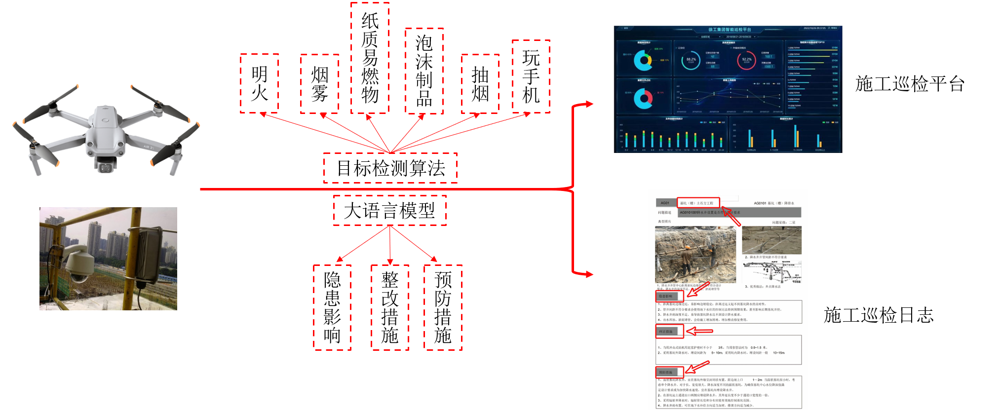
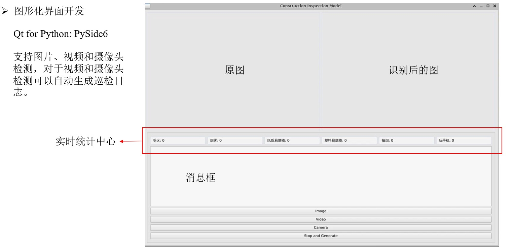
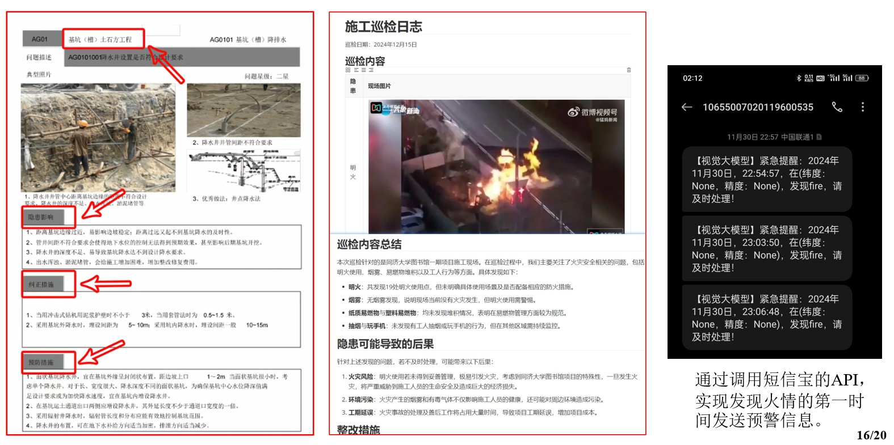

# 智能设计与建造课程作业——施工巡检模型及其图形化界面
场景需求：

## 模型训练及使用
目标检测模型采用YOLOv5，数据集采用YOLO格式，图片及相应标签存放至`datasets`文件夹下。本项目也提供了本次作业训练得到的较优权重`best.pt`。
模型保留了传统YOLOv5模型的训练、验证和预测的代码(见train.py、val.py和detect.py)，便于后续可加入一些新的数据集进行训练。对于权重默认采用`best.pt`，数据集格式默认为`data/custom_data.yaml`，其他默认参数取值详见源码。下面是一个较为完整的示例。

**环境准备：**
```
pip install -r requirements.txt
```
**模型训练：**
```
python train.py --data custom_data.yaml --weights best.pt --img 640 --batch-size 8 --device 0 --cache ram --epochs 100
```
**模型验证：**
```
python val.py --weights best.pt --data custom_data.yaml  --img 640
```
**模型预测：**（预测单张图片，视频也可，选项同YOLO）
```
python detect.py --weights best.pt --data custom_data.yaml --source ./data/images/21.jpg   
```

**启动施工巡检模型的命令:**
```python
python main.py --weights best.pt --data custom_data.yaml  --device 0
```
也可以直接运行`python main.py`，参数默认采用为上面这行命令。


tips:
1. 云服务器中linux系统下中文支持：`cp /mnt/Arial.Unicode.ttf  /root/.config/Ultralytics/`，也就是说需要准备相应字体，否则图形化界面中文乱码。


## 模型调用的API
当中在`utilsbymeself`文件夹下存放了几个工具，主要是调用外部API实现某种功能，要想运行，需要将相应的API key改成自己的，在各公司官网上都有详尽示例，这里就不再详细赘述。
1. [acquire_data_location.py](https://lbsyun.baidu.com/apiconsole/center)：通过调用百度地图的API实现将图片中的经纬度坐标转化成省市区街道名称等。
2. [auto_sending_message.py](https://console.smsbao.com/#/login?redirect=%2Findex)：通过调用短信宝的API，实现当模型发现火情的第一时间发送短信给相关负责人。
3. [llm_generate_file.py](https://login.bce.baidu.com/?redirect=https%3A%2F%2Fconsole.bce.baidu.com%2Fqianfan%2Foverview)：通过调用百度智能云提供的大模型实现施工巡检日志中发现问题的解决方案。

## 生成结果
下面是施工巡检模型图形化界面。

最后还会生成施工巡检报告。


## 讨论
限于水平和时间，模型肯定有诸多不足之处，还望见谅。如果新的想法，可一起交流。

## 演示视频
后期如果视频上传到B站了，附上相应的演示视频。